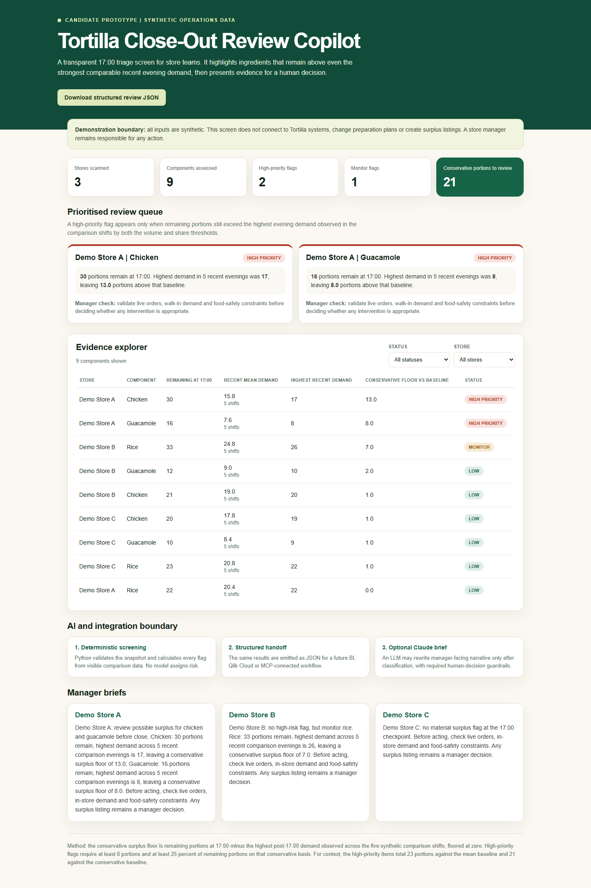

# Tortilla Close-Out Review Copilot

A candidate-built prototype inspired by Tortilla's AI Innovation Intern opportunity: a store-facing tool that screens a synthetic 17:00 ingredient snapshot for possible end-of-shift surplus, shows the evidence, and prepares a manager brief.

This is an independent demonstration. It uses **synthetic data only**, is not connected to Tortilla systems and never makes a preparation, waste or surplus-listing decision.

**Live dashboard:** https://agrawalneel25.github.io/tortilla-surplus-review-demo/



## Quick Tour

Open the live dashboard without any setup:

1. The summary row identifies `2` high-priority ingredient flags and `21` conservative portions to review.
2. The prioritised queue explains why chicken and guacamole at `Demo Store A` are surfaced for a human check.
3. The evidence explorer can be filtered by store or status and exposes every input to the flag.
4. The **Download structured review JSON** link demonstrates a stable handoff for a later BI, Qlik Cloud or MCP-connected workflow.
5. The manager briefs state the review required while leaving all operational action with staff.

## Product Choice

For a restaurant business, an initial AI-enabled tool should earn trust before it recommends action. This prototype focuses on close-out surplus review because it is measurable, operationally relevant and easy for a manager to challenge from visible evidence.

A simple calculation could compare remaining portions to average recent demand. This prototype takes a more conservative approach: it flags an item as high priority only when it remains materially above the **highest** evening demand seen in the comparison shifts. The manager sees the mean as context, but the queue is driven by the stronger test.

## Decision Logic

The committed example has five synthetic comparison evenings for each store and component, plus one synthetic current snapshot.

```text
portions_remaining = prepared_units - sold_units_by_17_00
mean_surplus_estimate = max(portions_remaining - mean(recent evening demand), 0)
conservative_surplus_floor = max(portions_remaining - max(recent evening demand), 0)
```

| Status | Deterministic rule |
| --- | --- |
| High priority | Conservative floor is at least 8 portions and at least 25% of portions remaining |
| Monitor | Conservative floor is at least 4 portions but does not pass both high-priority thresholds |
| Low | Conservative floor is below 4 portions |

This is a review signal against a small synthetic baseline, not a demand forecast or proof that food will be surplus.

## AI And Integration Boundary

The risk classification is deliberately deterministic and testable:

```text
synthetic CSV inputs -> validated Python screening -> fixed evidence and classifications
                                                    -> deterministic brief (default)
                                                    -> optional Claude brief (narrative only)
outputs: review.json + static dashboard
```

`docs/review.json` is the machine-readable output contract. It contains the method, summary, item-level evidence and briefs, making the prototype straightforward to adapt to data received through Qlik Cloud or an MCP server.

The optional Claude path receives calculated findings only. It cannot alter the table or classifications, must keep the human-decision guardrail in each narrative, and is not used by the published dashboard.

## Run Locally

Requirements: Python 3.10 or later. The deterministic path uses no third-party packages.

On Windows:

```powershell
python -m src.run_demo
start docs\index.html
```

On macOS or Linux:

```bash
python -m src.run_demo
open docs/index.html
# or: xdg-open docs/index.html
```

Expected console summary:

```text
Tortilla Close-Out Review Copilot: synthetic 17:00 snapshot
Stores checked: 3
Items checked: 9
High-priority flags: 2
Monitor flags: 1
Conservative portions in high-risk flags: 21
Mean-estimate portions in high-risk flags: 23
```

The run regenerates `docs/index.html` and `docs/review.json`, the same deterministic artifacts served through GitHub Pages.

## Optional Claude Briefs

To demonstrate a narrow LLM integration after deterministic classification, provide an Anthropic API key:

```powershell
$env:ANTHROPIC_API_KEY="your-key"
python -m src.run_demo --claude
start docs\index.html
```

```bash
export ANTHROPIC_API_KEY="your-key"
python -m src.run_demo --claude
open docs/index.html
```

The direct Messages API call defaults to `claude-sonnet-4-6`. Do not commit a generated Claude version of `docs/index.html` or `docs/review.json`; the public build is intentionally deterministic and key-free.

## Test

```powershell
python -m unittest discover -s tests
python -m src.run_demo
git diff --exit-code -- docs/index.html docs/review.json
```

The tests cover conservative classification, the distinction between mean estimates and the high-priority floor, manager guardrails, structured JSON output, HTML output, invalid snapshot rejection and optional Claude boundary validation. GitHub Actions runs these checks across Python 3.10, 3.11 and 3.12.

## Production Path

A real pilot would require controls beyond this illustrative prototype:

1. Replace synthetic CSV snapshots with authorised, read-only sales and prep inputs through the business data environment.
2. Validate historical windows by store, weekday, promotion, channel mix, local events and weather before using a threshold operationally.
3. Log manager review outcomes without automating an intervention, then measure false-positive flags, surplus portions avoided and time saved.
4. Add role-based access, audit history and food-safety governance before any operational deployment.

## Repository Structure

```text
data/              synthetic comparison shifts and current snapshot
docs/index.html    generated GitHub Pages dashboard
docs/review.json   generated structured handoff artifact
src/analysis.py    validated deterministic classification logic
src/briefs.py      deterministic manager-facing narratives
src/claude.py      optional constrained Claude narrative path
src/export.py      JSON output contract builder
src/report.py      standalone interactive HTML report generator
src/run_demo.py    command-line entry point
tests/             unit tests
```
